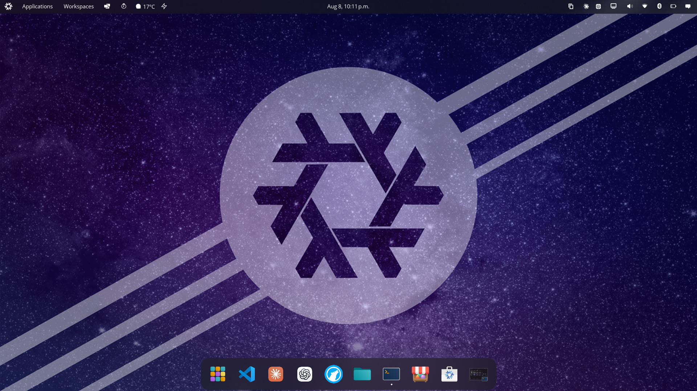
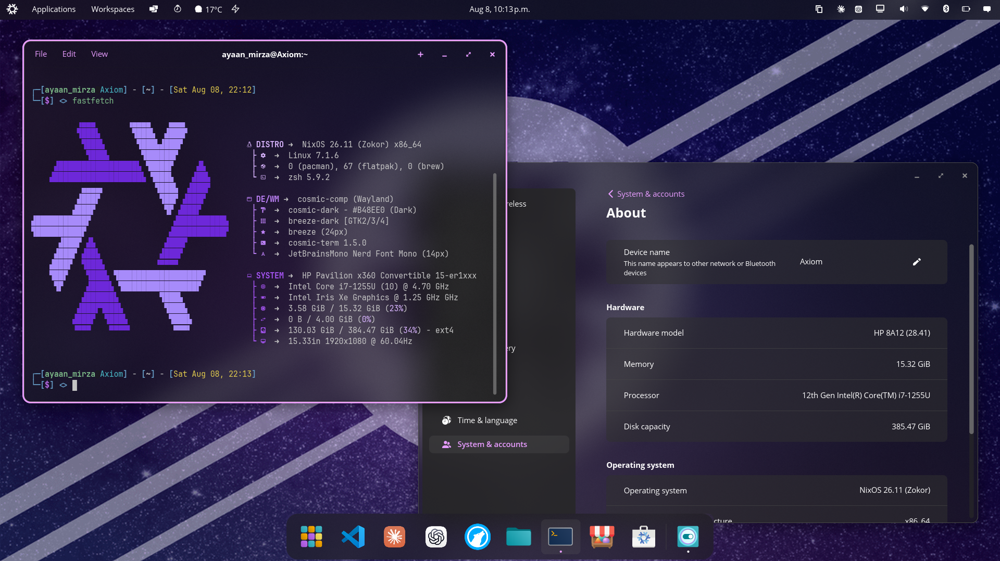

<h2 align="center">:snowflake: Axiom Nix Config :snowflake:</h2>

  

    
    

> My configuration is becoming more and more complex, but it should be readable for beginners as it is clearly organized into modules and contains comments for guidance.

This repository is home to the nix code that builds my system:

- **NixOS Desktop (Axiom)** — my main daily driver, running Cosmic and Plasma6 desktop environments, PipeWire audio, Waydroid, and extensive customization.

See [`./modules/`](./modules/) for each configuration module, and [`./dotfiles/`](./dotfiles/) for user-specific config files synced via activation scripts.

## Why NixOS & Flakes?

Nix allows for easy-to-manage, collaborative, reproducible deployments — once something is set up and configured, it works (almost) forever. If someone shares their configuration, anyone can reuse it (assuming they understand what they're copying).

Flakes make dependency management and reproducibility trivial by locking inputs and providing a clean interface for outputs.

**Want to learn NixOS & Flakes in detail?** The [NixOS documentation](https://nixos.org/manual/nixos/stable/) and [Nix Pills](https://nixos.org/guides/nix-pills/) are excellent resources.
 
## Components

### Desktop Environment & Shell
| | |
|---|---|
| **Bootloader** | systemd-boot with Secure Boot signing via sbctl |
| **Boot Theme** | Plymouth (mac-style) |
| **Optional Boot Menu** | rEFInd with Catppuccin macchiato theme |
| **Display Manager** | cosmic-greeter |
| **Desktop Environments** | Cosmic (primary), Plasma6 |
| **Window Managers** | Cosmic native WM, KWin (Plasma6) |
| **Terminal Emulator** | Ghostty |
| **Shell** | Zsh + Oh-My-Zsh (xiong-chiamiov-plus theme; plugins: git, npm, history, node, rust, deno, snap) |
| **Notification Daemon** | Cosmic native services |
| **Network Management** | NetworkManager |
| **Input Method** | None (default XKB/Wayland input) |

### Apps & Tools
| | |
|---|---|
| **System Monitor** | Fastfetch (terminal), built-in DE monitors |
| **File Manager** | Files (COSMIC), Dolphin (KDE) |
| **Media Player** | mpv, VLC |
| **Editors / IDE** | Neovim, VS Code, Vim |
| **Fonts** | Noto fonts, Noto Color Emoji, JetBrains Mono Nerd Font |
| **Image Viewer** | Gwenview, gThumb |
| **Screenshots** | COSMIC Screenshot (Wayland), Spectacle (KDE) |
| **Screen Recording** | OBS |
| **Development Tools** | Git, Python3, Node.js, Rust, Java, Go, etc. |

### System-Level
| | |
|---|---|
| **Filesystem & Encryption** | Ext4, no encryption (dual-boot system) |
| **Secure Boot** | Enabled via sbctl, auto-signing |
| **Android Subsystem** | Waydroid |
| **Package Formats** | Snap, Flatpak, AppImage, Nix |

Wallpapers: https://github.com/MirzaAyBaig12/nix-config/tree/main/wallpapers

## Screenshots

| Desktop | Fastfetch |
|---|---|
|  |  |

## System Modules

### flake.nix
Entry point — defines inputs (nixpkgs channel, home-manager, any overlays) and outputs for the system.

### system.nix
Low-level system configuration: bootloader (systemd-boot + sbctl Secure Boot), networking (NetworkManager), Waydroid Android subsystem.

### desktop.nix
Graphical environment: cosmic-greeter display manager, Cosmic + Plasma6 desktop environments, PipeWire audio (PulseAudio compat), CUPS printing, font configuration.

### programs.nix
User environment: Zsh + Oh-My-Zsh with plugins, shell aliases, desktop apps (Steam, Firefox/Librewolf, Codex Desktop), and system packages (dev tools → multimedia).

### services.nix
System services: Snap/Flatpak daemons, security config (doas + sudo for `ayaan_mirza`), user account setup, activation scripts for dotfile sync (Fastfetch config, bidirectional rEFInd sync).

User-level configuration managed through Home Manager. Mirrors the modular structure of the main configuration, keeping dotfiles and program configs organized into separate modules. (See [`./modules/home-manager`](/modules//home-manager/))

## Why This Setup?

- **It should just work** — zero time spent debugging basic functionality
- **Keep it recreational** — if configuring something takes more effort than it's worth, I use defaults
- **Version control everything** — if it's not in git, it might as well not exist
- **Organization** — rather than directly declaring everything, they are loaded as modules (See [`./modules/`](/modules/))
- **Prefer flakes** — trivial dependency management and reproducibility

## What You Won't Find Here

- Instructions for others to install this (highly personalized to my hardware/preferences)
- Explanations of basic NixOS concepts (assumes familiarity with NixOS/Flakes)
- Attempts to make this "universal" or "generic" — this is my personal setup
- Apologies for unfree packages (I need some proprietary stuff for my workflow)
- Over-engineering — I optimize for actual usage, not hypothetical edge cases

This configuration evolves as my needs and interests change — check `git log` for what's current.
